# RTEU Course Note Templates Overview

This is the open-access course module documentation system that provides, presentation, online and offline multiple resource from single data-source. Markdown provided content is converted to several resources and directly provided to student. 

Github Pages is used for hosting. and Github/Git is used for documentation version management.  Each course can be linked each other with homepage links.

Lecturers can use markdown editors to update their content and then easily publish to Github Pages with Google Analytics Support.  

I used this my courses to make my and student life a bit easy. You can use similar templates for your courses. This is a combination of several tools. 

## Used Open Platform Stack

- pandoc

- rsvg-convert

- python

- miktex

- scoop

- curl

- marp

- mkdocs
  
  - extensions
    
    - pymdown-extensions
    
    - mkdocs-material
    
    - mkdocs-git-revision-date-localized-plugin
    
    - mkdocs-minify-plugin
    
    - mkdocs-static-i18n
    
    - mkdocs-with-pdf
    
    - qrcode
    
    - mkdocs-awesome-pages-plugin

- pptx2md

- git / github


## Installation

### Step-1: Version Management and GIT

Install Git and Git Extension Tools

You can install Git GUI from [Git - GUI Clients](https://git-scm.com/downloads/guis) I prefer to use git extension [Git Extensions | Git Extensions is a standalone UI tool for managing Git repositories](https://gitextensions.github.io/) and [TortoiseGit – Windows Shell Interface to Git](https://tortoisegit.org/)

Also Download KDiff3 [KDiff3 - Browse Files at SourceForge.net](https://sourceforge.net/projects/kdiff3/files/)

These extensions provide GUI for git operations to make process easier.

I recommend my course notes for this 

[CE103 Algorithms and Programming I - RTEU CE103 Algorithms and Programming-I Course Notes](https://ucoruh.github.io/ce103-algorithms-and-programming-I/week-3-git/ce103-week-3-git/#git-in-action-3)

### Step-2 : Clone/Fork or Copy Current Template

 Fork or Update Remote for Your Course, Also you can rename repository name

[CE103 Algorithms and Programming I - RTEU CE103 Algorithms and Programming-I Course Notes](https://ucoruh.github.io/ce103-algorithms-and-programming-I/week-3-git/ce103-week-3-git/#adding-initiated-repo-remote-upstream-repo-link-with-github-repo-1)

### Step-3: Required CLI Application Installation

Run **run_mkdocs_required_app_install.bat** as admin. (I tried this on Windows) this will install required applications for you. There will several confirmation just select A [All] to complete installation. 

###### Content of run_mkdocs_required_app_install.bat

```batch
@echo off
@setlocal enableextensions
@cd /d "%~dp0"

Powershell.exe Set-ExecutionPolicy Bypass -Scope Process -Force; [System.Net.ServicePointManager]::SecurityProtocol = [System.Net.ServicePointManager]::SecurityProtocol -bor 3072; iex ((New-Object System.Net.WebClient).DownloadString('https://community.chocolatey.org/install.ps1'))

Powershell.exe choco install pandoc
Powershell.exe choco install rsvg-convert
Powershell.exe choco install python
Powershell.exe choco install miktex

Powershell.exe Invoke-Expression (New-Object System.Net.WebClient).DownloadString('https://get.scoop.sh')
Powershell.exe Set-ExecutionPolicy RemoteSigned -scope CurrentUser
Powershell.exe scoop install curl
Powershell.exe scoop install marp


pip install mkdocs
pip install pymdown-extensions
pip install mkdocs-material
pip install mkdocs-git-revision-date-localized-plugin
pip install mkdocs-minify-plugin
pip install mkdocs-static-i18n
pip install mkdocs-with-pdf
pip install qrcode
pip install mkdocs-awesome-pages-plugin

pip install pptx2md
pause
```

### Step-4: Marktext App Installation for Markdown Editor

Download and Install https://marktext.app/


Editor View

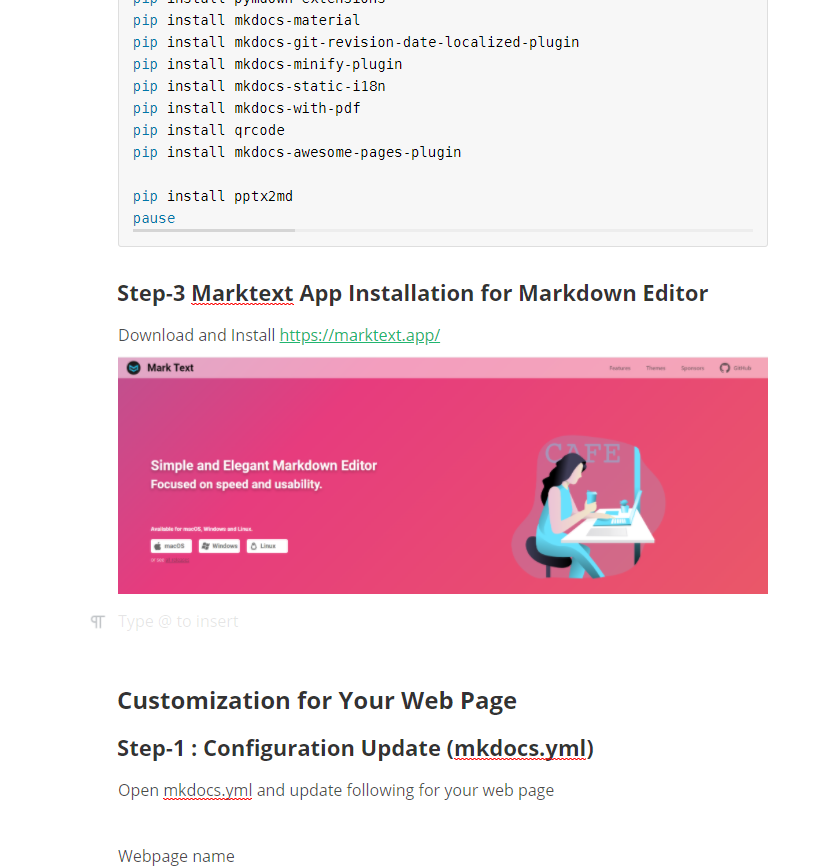

You can open any markdown file and edit directly on this app. 

### Step-5 Marp Editor Extension Installation for Presentation

Download and Install visual studio code https://code.visualstudio.com/

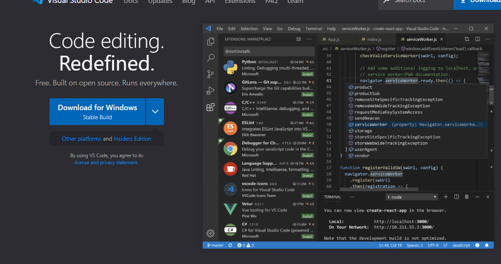

We are using https://marp.app/ presentation platform and it has extension for real-time presentation editing on vs-code

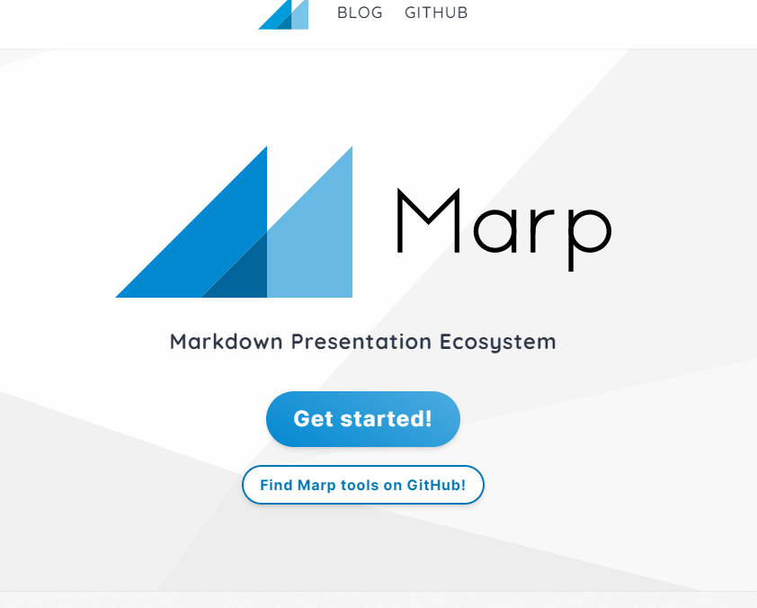

After visual studio installation enter the course-note-template folder and right click then select `open with code`  

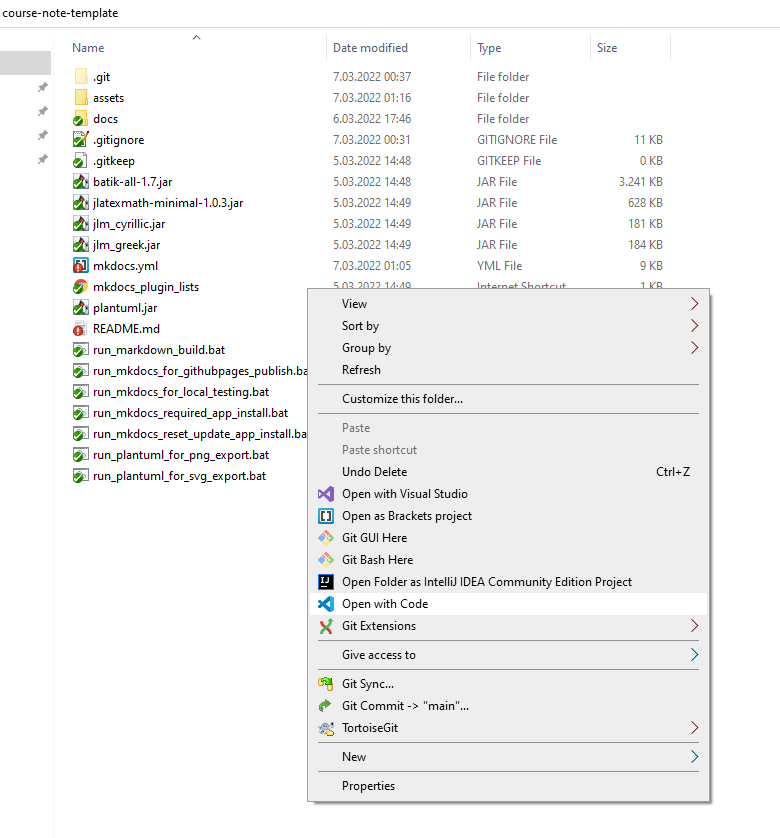

Select extensions or `CTRL+SHIFT+X` will help you to open extension list and write marp in search textbox

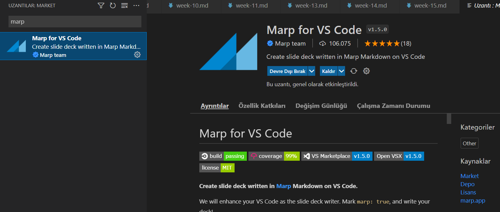

Install Marp for VS Code 

Select Manage By Clicking Gear Icon

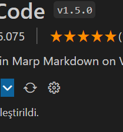

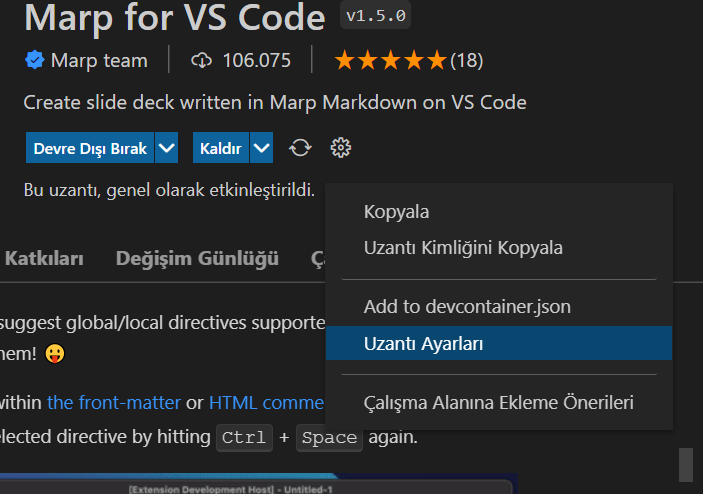

Update your config as follow and enable HTML 

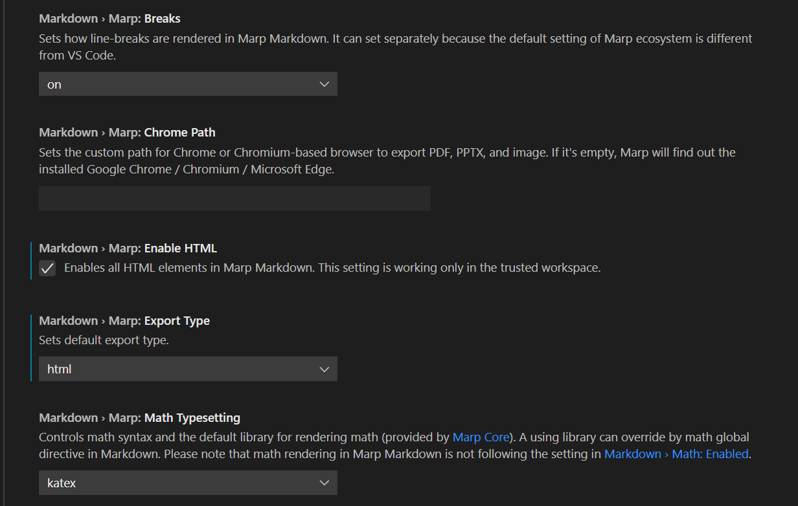

after installation open markdown files in the folders these will be your content 

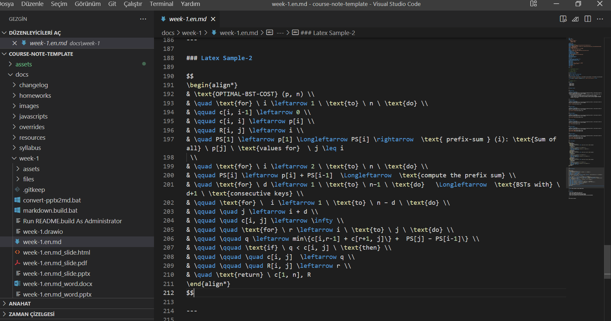

On the right top of the screen you will find extension button click it to enable preview

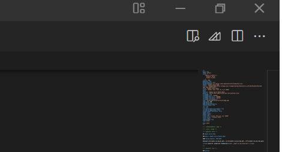

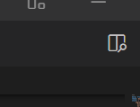

After enabling preview you will see your markdown as presentation and if you edit your markdown content will be automatically updated

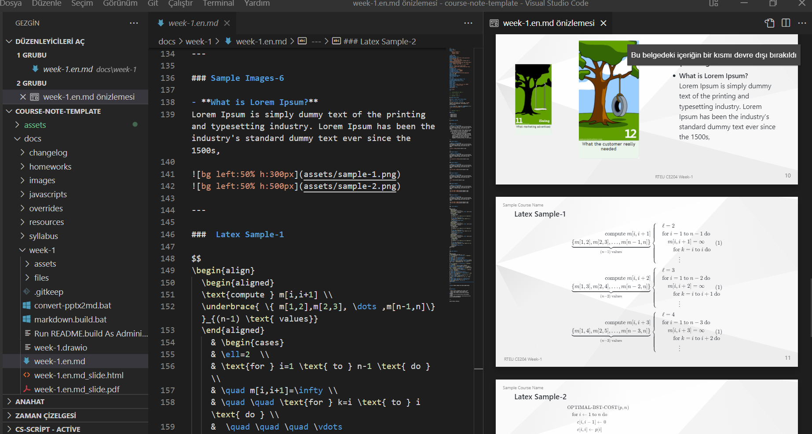

Untill this step you just finished to edit content for presentation and normal documentation. 

## Customization for Your Web Page

### Step-1 : Configuration Update (mkdocs.yml)

Open mkdocs.yml and update following for your web page

Webpage name

```batch
site_name: RTEU Course Notes Templates
```

Webpage Author and URL on Github Pages

```batch
site_author: 'Asst. Prof. Dr. Uğur CORUH'
site_url: 'https://ucoruh.github.io/course-note-template/'
```

Site Description on Homepage, in normal configuration there was single `site_description` for Turkish and English I duplicated configuration and checked in homepage.html

```batch
site_description_en: >-
    Course Notes Templates

site_description_tr: >-
    Ders Notu Şablonu
```

Github Repo of Webpage

```batch
repo_url: 'https://github.com/ucoruh/course-note-template'
```

Copyright Owner

```batch
# Copyright
copyright: Copyright © 2019 - 2022 Asst. Prof. Dr. Uğur CORUH
```

Theme Color, select primary and accent color for light and dark theme

You can use following link to select color [Changing the colors - Material for MkDocs](https://squidfunk.github.io/mkdocs-material/setup/changing-the-colors/)

```batch
  palette:
    - scheme: default
      primary: lime
      accent: lime
      toggle:
        icon: material/toggle-switch
        name: Switch to dark mode
    - scheme: slate
      primary: blue grey
      accent: blue grey
      toggle:
        icon: material/toggle-switch-off-outline
        name: Switch to light mode
```

Your icon in `docs/images/favicon.png` and font if you need

```batch
  font:
    text: Roboto
    code: Roboto Mono
  favicon: images/favicon.png
  icon:
    logo: logo
    #logo: assets/images/favicon.png
```

Also you can set your google analytics key in github repository as a SECRET and on your  local computer as environment parameter and use in configuraton

```batch
# Customization
extra:
  analytics:
    provider: google
    property: !ENV GOOGLE_ANALYTICS_KEY_TEMPLATE
```

Update your social links if you do not have delete related links

```batch
  social:
    - icon: fontawesome/brands/github
      link: https://github.com/ucoruh
    - icon: fontawesome/brands/bitbucket
      link: https://bitbucket.org/ucoruh/
    - icon: fontawesome/regular/compass
      link: https://www.scopus.com/authid/detail.uri?authorId=57218950743
    - icon: fontawesome/regular/id-card
      link: https://dblp.org/pid/230/0394.html
    - icon: fontawesome/brands/docker
      link: https://hub.docker.com/u/ucoruh/
    - icon: fontawesome/brands/orcid
      link: https://orcid.org/my-orcid?orcid=0000-0003-4193-8401
    - icon: fontawesome/brands/linkedin
      link: https://www.linkedin.com/in/ugurcoruh/
    - icon: fontawesome/regular/moon
      link: https://publons.com/researcher/1540204/ugur-coruh/
    - icon: fontawesome/brands/google
      link: https://scholar.google.com/citations?user=KIU4ltMAAAAJ&hl=tr
    - icon: fontawesome/regular/clipboard
      link: https://avesis.erdogan.edu.tr/ugur.coruh
    - icon: fontawesome/regular/user-circle
      link: https://www.ugurcoruh.com/
```

Your web page default language and default language force setting can be set via Github SECRET as follow. Set `DEFAULT_LANGUAGE` and `DEFAULT_LANGUAGE_ONLY` on your github repository. 

```batch
plugins:
  - search
  - i18n:
      default_language: !ENV [DEFAULT_LANGUAGE, "en"]
      default_language_only: !ENV [DEFAULT_LANGUAGE_ONLY, false]
```

Select your languages, if you change languages you should change `site_description_en` and `site_description_tr` also

```batch
      languages:
        default:
          name: Default (en)
          build: true
        en:
          name: English
          build: true
          site_name: "RTEU Course Notes Templates (en)"
        tr:
          name: Türkçe
          build: true
          site_name: "RTEU Ders Notu Şablonu (tr)"
```

First Generate your Page Tree

```batch
# Page tree
nav:
  - Home: index.md
  - Syllabus: syllabus/syllabus.md
  - Course Modules:
    - Week-1 (Sample-1): week-1/week-1.md
    - Week-2 (Sample-2): week-2/week-2.md
    - Week-3 (Sample-3): week-3/week-3.md
    - Week-4 (Sample-4): week-4/week-4.md
    - Week-5 (Sample-5): week-5/week-5.md
    - Week-6 (Sample-6): week-6/week-6.md
    - Week-7 (Sample-7): week-7/week-7.md
    - Week-8 (Midterm): week-8/week-8-midterm.md
    - Week-9 (Sample-9): week-9/week-9.md
    - Week-10 (Sample-10): week-10/week-10.md 
    - Week-11 (Sample-11): week-11/week-11.md 
    - Week-12 (Sample-12): week-12/week-12.md
    - Week-13 (Sample-13): week-13/week-13.md
    - Week-14 (Sample-14): week-14/week-14.md
    - Week-15 (Sample-15): week-15/week-15.md
    - Week-16 (Final): week-16/week-16-final.md
  - License: license.md
  - Changelog: changelog/index.md
```

Then add your translation to configuration for each menu item

```batch
      nav_translations:
        tr:
          Home: 'Ana Sayfa'
          Syllabus: 'Ders İzlencesi'
          Course Modules: 'Ders Modülleri'
          Week-1 (Sample-1): 'Hafta-1 (Örnek-1)'
          Week-2 (Sample-2): 'Hafta-2 (Örnek-1)'
          Week-3 (Sample-3): 'Hafta-3 (Örnek-1)'
          Week-4 (Sample-4): 'Hafta-4 (Örnek-1)'
          Week-5 (Sample-5): 'Hafta-5 (Örnek-1)'
          Week-6 (Sample-6): 'Hafta-6 (Örnek-1)'
          Week-7 (Sample-7): 'Hafta-7 (Örnek-1)'
          Week-8 (Midterm): 'Hafta-8 (Vize)'
          Week-9 (Sample-9): 'Hafta-9 (Örnek-1)'
          Week-10 (Sample-10): 'Hafta-10 (Örnek-1)'
          Week-11 (Sample-11): 'Hafta-11 (Örnek-1)'
          Week-12 (Sample-12): 'Hafta-12 (Örnek-1)'
          Week-13 (Sample-13): 'Hafta-13 (Örnek-1)'
          Week-14 (Sample-14): 'Hafta-14 (Örnek-1)'
          Week-15 (Sample-15): 'Hafta-15 (Örnek-1)'
          Week-16 (Final): 'Hafta-16 (Final)'
          License: 'Lisans'
          Changelog: 'Geçmiş'
```

## Step-2:  Update Markdown for Course Content

You can check markdown syntax if you do not have any idea

[Basic Syntax | Markdown Guide](https://www.markdownguide.org/basic-syntax/)

But marktext app will help you to create documentation for your content. 

Dividing content into slides done by `---` characters and you can easily copy-paste images on the marktext app but there is a problem about folders. You need to update image links as follow for assets folder. 

```batch

```

Otherwise your content won't be seen on webpage. 

**Before Updating Image Links**


**After Updating Image Links**

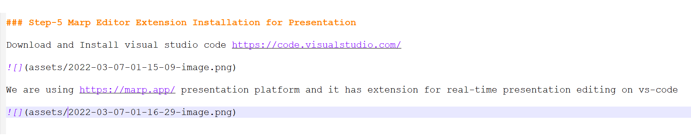

> Recommendation : Use MarktextApp + VSCode at the same time for same markdown file and just focus on presentation preparation, then other content will be also good for web page.  

There is samples on markdown files. 

### Step-3: Content Localization

There will be two markdown file for each content named for example

week-1.en.md for English content week-1.tr.md for Turkish content you need to update them or translate them. 

### Step-4: Figures and Images

For figures I use plantuml and drawio.

https://plantuml.com/

[PlantUML Web Server](http://www.plantuml.com/plantuml/uml/SyfFKj2rKt3CoKnELR1Io4ZDoSa70000)

https://app.diagrams.net/

 You can draw your content on drawio and then you can export as SVG to assets folders and then you can give link in markdown file. If you update drawio content and export with same name then you won't need to update link also. Some complex figures can be provided via plantuml and in assets folder just create *.uml files then run **run_plantuml_for_svg_export.bat** file to process this uml files as SVG if you write links in your markdown content will be automatically updated after each update and process. 

### Step-5: HTML / PDF / DOCX / PPTX Output Generation

There is several types of outputs for content

HTML presentation system used as iframe and published with webpage as follow. You do not any tool for presentation you can directly use it. 

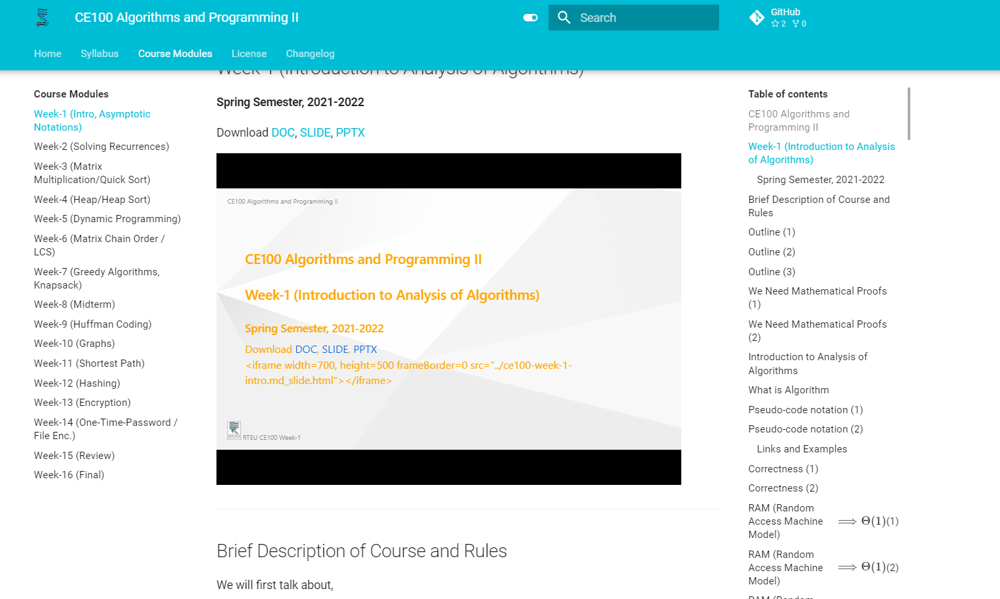

Students can download same content as PDF, PPTX and DOCX with links

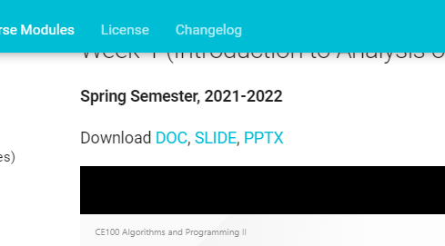

In each week there is a bat file named **markdown.build.bat** 

###### Content of markdown.build.bat

```batch
@echo off
@setlocal enableextensions
@cd /d "%~dp0"

for %%# in (*.en.md) do set  "file_name=%%~nx#"

echo file found "%file_name%"
Powershell.exe marp %file_name% --html --pdf -o %file_name%_slide.pdf --allow-local-files
Powershell.exe marp %file_name% --html -o %file_name%_slide.html --allow-local-files
Powershell.exe marp %file_name% --pptx -o %file_name%_slide.pptx --allow-local-files
rem call Powershell.exe pandoc %file_name% --pdf-engine=xelatex -V colorlinks -V urlcolor=NavyBlue -V toccolor=Red --toc -N -o %file_name%_doc.pdf
Powershell.exe pandoc %file_name% --pdf-engine=xelatex -f markdown-implicit_figures -V colorlinks -V urlcolor=NavyBlue -V toccolor=Red --toc -N -o %file_name%_doc.pdf
Powershell.exe pandoc -o %file_name%_word.docx -f markdown -t docx %file_name%
Powershell.exe pandoc -o %file_name%_word.pptx -f markdown -t pptx %file_name% 

for %%# in (*.tr.md) do set  "file_name=%%~nx#"

echo file found "%file_name%"
Powershell.exe marp %file_name% --html --pdf -o %file_name%_slide.pdf --allow-local-files
Powershell.exe marp %file_name% --html -o %file_name%_slide.html --allow-local-files
Powershell.exe marp %file_name% --pptx -o %file_name%_slide.pptx --allow-local-files
rem call Powershell.exe pandoc %file_name% --pdf-engine=xelatex -V colorlinks -V urlcolor=NavyBlue -V toccolor=Red --toc -N -o %file_name%_doc.pdf
Powershell.exe pandoc %file_name% --pdf-engine=xelatex -f markdown-implicit_figures -V colorlinks -V urlcolor=NavyBlue -V toccolor=Red --toc -N -o %file_name%_doc.pdf
Powershell.exe pandoc -o %file_name%_word.docx -f markdown -t docx %file_name%
Powershell.exe pandoc -o %file_name%_word.pptx -f markdown -t pptx %file_name% 

pause
```

If you run this file it use **marp** and **pandoc** to generate output files for several markdown files. In this sample I just duplicated export operation for Turkish and English md files but there can be better way of this.  This conversion takes a bit time for these reason I just converted what I modified. So there is multiple files in each week. 

### Step-6: Local Testing Before Publish

Run **run_mkdocs_for_local_testing.bat** to start local server for testing you can easily see content.  Run as admin. 

###### Content of run_mkdocs_for_local_tesing.bat

```batch
@echo off
@setlocal enableextensions
@cd /d "%~dp0"
mkdocs serve
pause
```

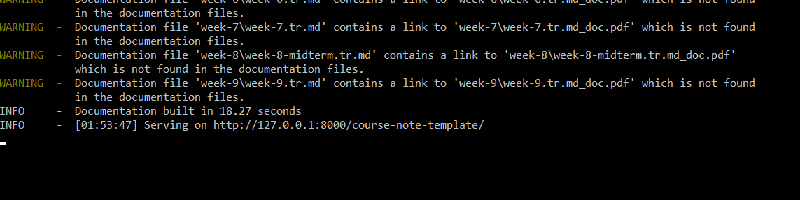


### Step-7: Commit Your Changes and Push to Remote Repository

Right click to repository folder and select git-extension and select commit

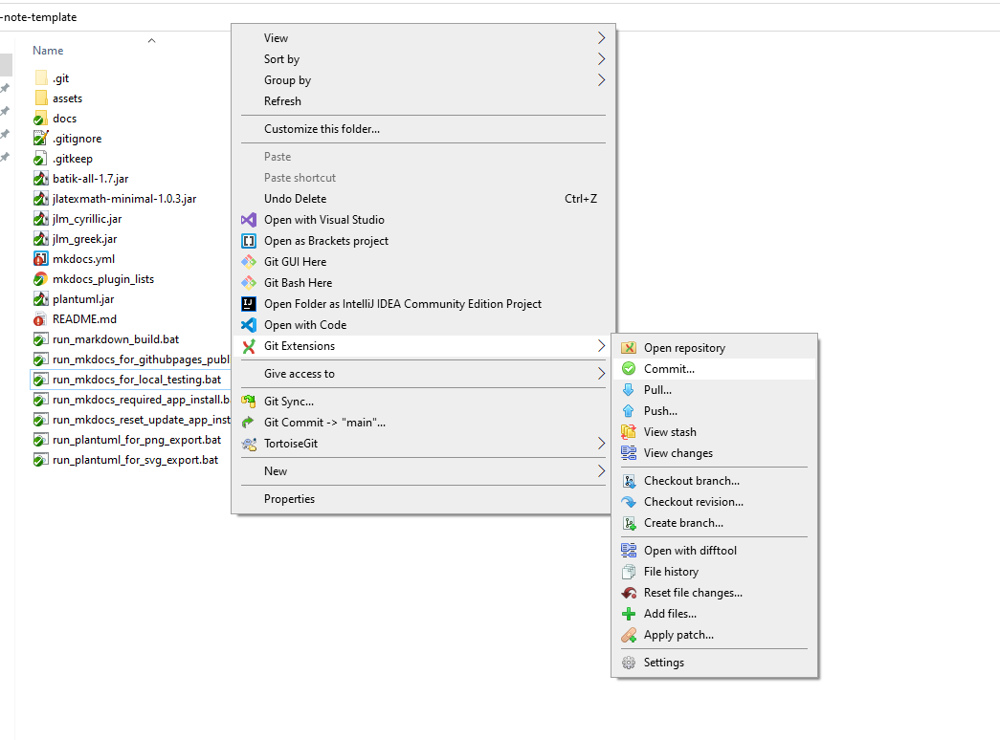

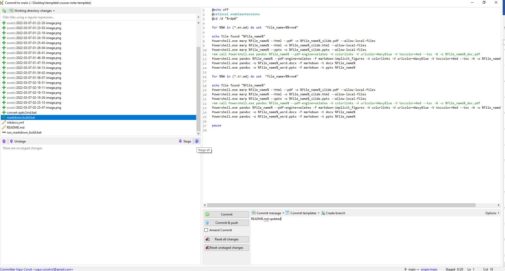

Click `Stage-All` and Write Your Commit Then Click `Commit&Push`

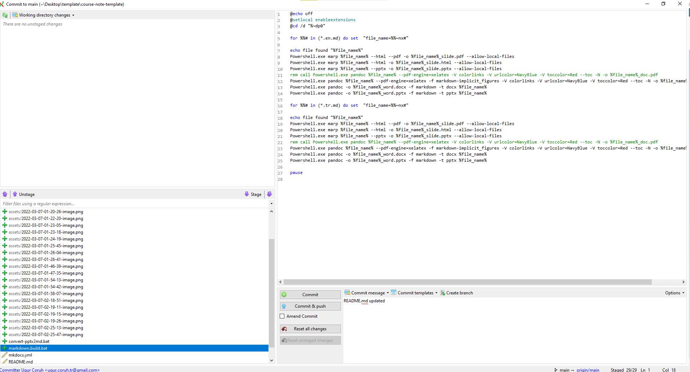

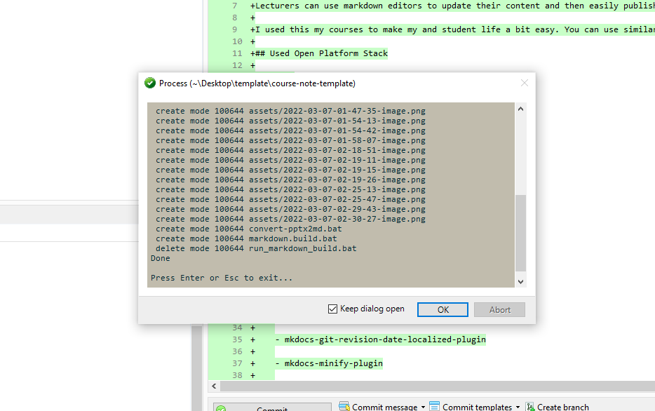

### Step-8: Publishing Web Site

Run **run_mkdocs_for_githubpages_publish.bat** This will run following commands 

```bash
@echo off
@setlocal enableextensions
@cd /d "%~dp0"
mkdocs gh-deploy --force
pause
```

and push your content to remote repository and start a deployment action. After deployment completed you can easily access your web page from your link

```bash
site_url: 'https://ucoruh.github.io/course-note-template/
```

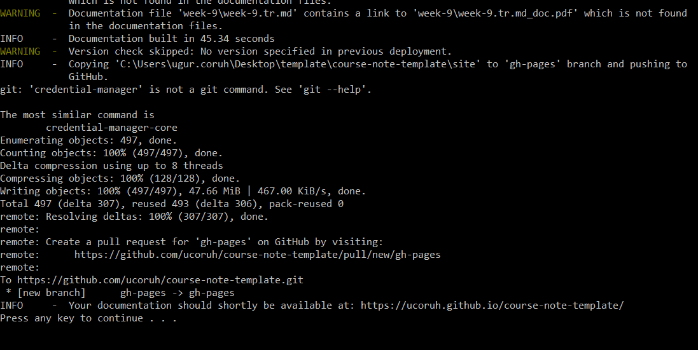

### Step-9: PPTX Conversion to Markdown

In each week you will find **convert-pptx2md.bat** file this file use [GitHub - ssine/pptx2md: a pptx to markdown converter](https://github.com/ssine/pptx2md) to convert pptx to markdown. It convert 80% of presentation but you need to divide pages and modify your content.  Also you need to update image links in for assets. 

###### Content of convert-pptx2md.bat

```batch
@echo off
@setlocal enableextensions
@cd /d "%~dp0"
for %%# in (*.pptx) do set "file_name=%%~nx#"
echo file found %file_name%
rem python 3.6-3.9 is required for pptx2md set PATH variable
Powershell.exe pptx2md --disable-escaping ./%file_name% -o ./%file_name%.md -i ./assets
pause
```

This extension works with python 3.6-3.9 You need to install python 3.9 and then you need to update PATH to run for 3.9. Normal bat file installation update python 3.10 or latest. 

[Python Release Python 3.9.0 | Python.org](https://www.python.org/downloads/release/python-390/)

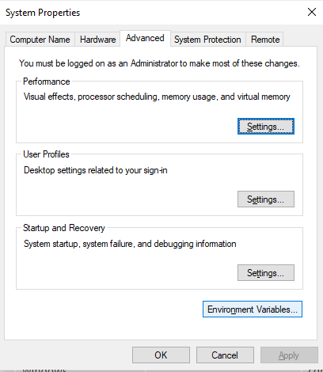

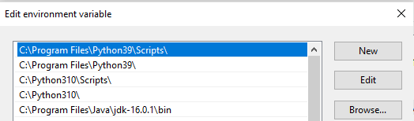

## Reset or Update Installation

Run **run_mkdocs_reset_update_app_install.bat** but it will re-install apps for you

###### Content of run_mkdocs_reset_update_app_install.bat

```batch
@echo off
@setlocal enableextensions
@cd /d "%~dp0"

Powershell.exe Set-ExecutionPolicy Bypass -Scope Process -Force; [System.Net.ServicePointManager]::SecurityProtocol = [System.Net.ServicePointManager]::SecurityProtocol -bor 3072; iex ((New-Object System.Net.WebClient).DownloadString('https://community.chocolatey.org/install.ps1'))

Powershell.exe choco install pandoc --force --force-dependencies
Powershell.exe choco install rsvg-convert --force --force-dependencies
Powershell.exe choco install python --force --force-dependencies
Powershell.exe choco install miktex --force --force-dependencies

Powershell.exe Invoke-Expression (New-Object System.Net.WebClient).DownloadString('https://get.scoop.sh')
Powershell.exe Set-ExecutionPolicy RemoteSigned -scope CurrentUser
Powershell.exe scoop install curl
Powershell.exe scoop update curl
Powershell.exe scoop install marp
Powershell.exe scoop update marp


pip install mkdocs
pip install --upgrade --force-reinstal pymdown-extensions
pip install --upgrade --force-reinstal mkdocs-material
pip install --upgrade --force-reinstal mkdocs-git-revision-date-localized-plugin
pip install --upgrade --force-reinstal mkdocs-minify-plugin
pip install --upgrade --force-reinstal mkdocs-static-i18n
pip install --upgrade --force-reinstal mkdocs-with-pdf
pip install --upgrade --force-reinstal qrcode
pip install --upgrade --force-reinstal mkdocs-awesome-pages-plugin

pip install --upgrade pptx2md
pause
```

## Extra Localization Support References

[Changing the language - Material for MkDocs](https://squidfunk.github.io/mkdocs-material/setup/changing-the-language/)

[GitHub - lukasgeiter/mkdocs-awesome-pages-plugin: An MkDocs plugin that simplifies configuring page titles and their order](https://github.com/lukasgeiter/mkdocs-awesome-pages-plugin)

[Create beautiful and localized documentations and websites using MkDocs + Github - Ultrabug](https://ultrabug.fr/Tech%20Blog/2021/2021-07-28-create-beautiful-and-localized-documentations-and-websites-using-mkdocs-github/)

[GitHub - ultrabug/mkdocs-static-i18n: MkDocs i18n plugin using static translation markdown files](https://github.com/ultrabug/mkdocs-static-i18n)

[GitHub - ultrabug/mkdocs-static-i18n: MkDocs i18n plugin using static translation markdown files](https://github.com/ultrabug/mkdocs-static-i18n)

[MkDocs static i18n plugin demo](https://ultrabug.github.io/mkdocs-static-i18n/)

[GitHub - orzih/mkdocs-with-pdf: Generate a single PDF file from MkDocs repository.](https://github.com/orzih/mkdocs-with-pdf)

[mkdocs-with-pdf/document.pdf at master · orzih/mkdocs-with-pdf · GitHub](https://github.com/orzih/mkdocs-with-pdf/blob/master/samples/mkdocs-material/document.pdf)

[mkdocs-with-pdf/samples/mkdocs-material at master · orzih/mkdocs-with-pdf · GitHub](https://github.com/orzih/mkdocs-with-pdf/tree/master/samples/mkdocs-material)

https://ultrabug.fr/

[Template Designer Documentation &#8212; Jinja Documentation (3.1.x)](https://jinja.palletsprojects.com/en/latest/templates/#variables)

[mkdocs-static-i18n · PyPI](https://pypi.org/project/mkdocs-static-i18n/#translating-navigation)

[GitHub - lukasgeiter/mkdocs-awesome-pages-plugin: An MkDocs plugin that simplifies configuring page titles and their order](https://github.com/lukasgeiter/mkdocs-awesome-pages-plugin)

[comparisons expression | Jinja Compat Tests](https://jbmoelker.github.io/jinja-compat-tests/expressions/comparisons/)

[Template Designer Documentation &#8212; Jinja Documentation (3.0.x)](https://jinja.palletsprojects.com/en/3.0.x/templates/)
