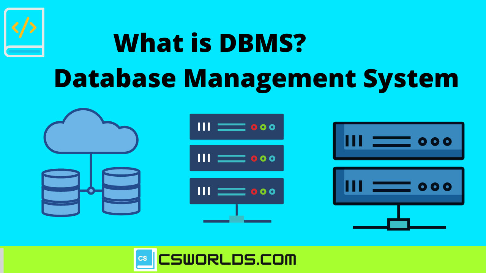
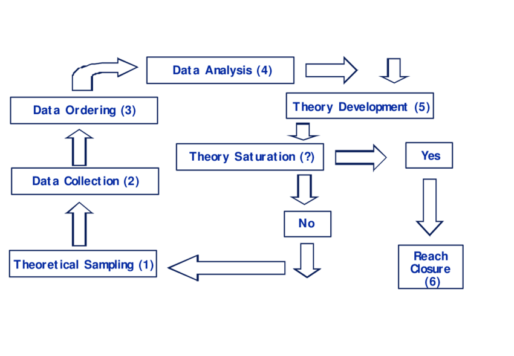

<!-- _backgroundColor: aquq -->

<!-- _color: green -->

<!-- paginate: false -->

## CE103 Algoritma ve Programlama I

### Hafta-1 (Veritabanı Sistemleri)

#### Bahar Dönemi, 2022-2023

İndir [DOC](week-1.tr.md_doc.pdf), [SLIDE](week-1.tr.md_slide.pdf), [PPTX](week-1.tr.md_slide.pptx)

<iframe width=700, height=500 frameBorder=0 src="../week-1.tr.md_slide.html"></iframe>

---

<!-- paginate: true -->

### Anahat

- Veritabanı ve İlişkisel Veritabanı    Anlamak
- Veritabanı Tasarımı

---

## **Veritabanı**

---

### Veritabanı

- **Veritabanı nedir?**
 1-) Veritabanı düzenli bilgiler topluluğudur.
 2-) Bilgisayar ortamında saklanan düzenli verilerdir. 
 3-) Bilgisayar terminolojisinde, sistematik erişim imkanı olan, yönetilebilir, güncellenebilir , taşınabilir, birbirleri arasında tanımlı ilişkiler
 bulunabilen bilgiler kümesidir.
 4-) Bilgisayarda sistematik şekilde saklanmış, programlarca işlenebilecek veri yığınıdır.
---

### VTYS

- **Veri Tabanı Yönetim Sistemi nedir?**
 Veri tabanı tanımlamak, yaratmak,
 yaşatmak ve veri tabanına denetimli
 erişim sağlamak için kullanılan
 yazılım sistemidir.

---

### VTYS

- **VTYS’ler aşağıdaki bilgileri barındırmaktadır;**
 İlişkili olan veriler ve veriye ulaşmak için gerekli olan yazılımlar kümesi

---

### VTYS

- **Veritabanı Sistemlerinin Üstünlükleri**
 Verinin tekrarlanmasını önler.Veritabanı sistemleri alt sistemler arasında ilişki kurulması ve birçok
 uygulamada verilerin aynı veritabanı içersinde ortak olarak tasarlanmasını öngörür.

---

### VTYS

- **Veritabanı Sistemlerinin Üstünlükleri**
 Verilerin tutarlı olmasını sağlar.Veri bütünlüğü(data integrity), verinin doğruluğunu ve tutarlığını
 ifade etmektedir. Veri girişlerine kısıtlar konularak sadece istenilen aralıkta değer girişi sağlanabilir.

---

### Varlık-İlişki Modeli
 Veri çözümleme ve modellemede ilişkilerin ortaya konması için kullanılan araçtır.Varlık: Bir alan içersinde diğer nesnelerden ayırt edilebilen bir şey yada “nesne”.
 Niteliklerin kümesi tarafından tanımlanır. İlişki: Birden fazla varlığın arasındaki bağıntı-ilişki.

---

### İlişki ve İlişki Kümeleri
 Varlıklar arasındaki bağlantıya ilişki adı verilir.örneğin “Burak” varlığı ile “Dersler” varlığı arasından ilişki  vardır.
 İlişki kümesi, aynı türdeki ilişkilerin kümesidir,bu ilişki kümesi R ile gösterilir.

---

## Referanslar

- https://avesis.erdogan.edu.tr/ugur.coruh
- https://www.linkedin.com/in/ugurcoruh/
- https://csworlds.com/what-is-dbms-database-management-system/ 
- https://prepinsta.com/dbms/entity-relationship-model-er-model/

---

$Hafta-2-Son$
