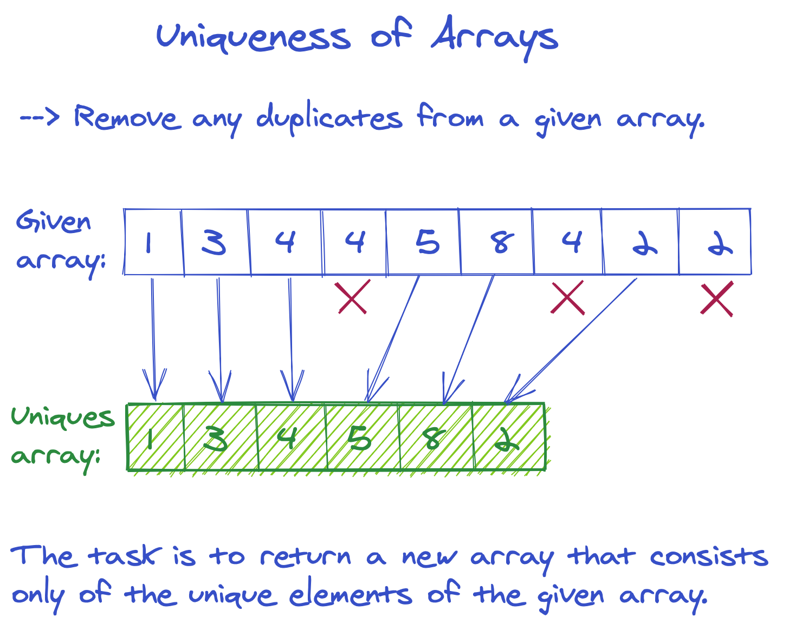

<!-- _backgroundColor: aquq -->

<!-- _color: green -->

<!-- paginate: false -->

## Örnek Ders Adı

### Hafta-2 (Veri Yapıları ve Algoritmalar)

#### Bahar Dönemi, 2022-2023

İndir [DOC](week-2.tr.md_doc.pdf), [SLIDE](week-2.tr.md_slide.pdf), [PPTX](week-2.tr.md_slide.pptx)

<iframe width=700, height=500 frameBorder=0 src="../week-2.tr.md_slide.html"></iframe>

---

<!-- paginate: true -->

### Anahat

- Algoritma Nedir?
- Bilgilerin Bilgisayarda İfadesi
- Diziler
- Bağlı listeler

---

## **Algoritma**

---

### Algoritma

- **Algoritma Nedir?**
    Algoritma, Cebrin atası ve kurucusu olarak bilinen Harezmî tarafından 9.yüzyılda cebir alanındaki araştırmaları neticesinde ortaya çıkmıştır. Avrupalılar, Harezmî ismini telaffuz edemediklerinden dolayı algorizm (Arap sayıları kullanarak aritmetik problemler çözme kuralları) olarak kullandılar. Algorizm daha sonra "algoritma" adını aldı.
    
---

### Algoritma

- **Algoritma Nedir?**
   Gördüğünüz üzere ana problemimiz bilgisayarın çalışmaması. İlk adım güç kablosunun takılı olup olmadığını kontrol etmek. Bu adımın cevabı Hayır ise yapmamız gereken güç kablosunu takmaktır, cevap Evet ve hâlâ bilgisayarımız çalışmıyor ise bir sonraki adımı uygulamamız gerekiyor. İkinci adım, uzatma kablosunun durumunu inceledikten sonra eğer bilgisayarımız hâlâ çalışmıyor ise tamire götürmemiz gerektiği sonucunu veriyor.
---

### Bilgilerin Bilgisayarda İfadesi

- 
   Bir insan kendini ifade etmek istediğinde native (ana) bir dil kullanıyor öyle değil mi? Bilgisayar da bilgiyi (Resim, ses, yazı vb) ifade etmek ve döngüyü sağlamak için bit (0 ve 1)' den oluşan ikili sayıları (Binary Numbers) kullanıyor.

---

### Bilgilerin Bilgisayarda İfadesi

- 
   İkili sayılarda bulunan 1 ve 0 rakamları (bit), bilgisayarın elektrik iletimi için kullandığı transistörlerin açık veya kapalı olma durumunu gösteriyor. Transistörlerde iki tane komut vardır, 0 (kapat) ve 1 (aç).

---

### Diziler
- 
   Diziler, anlam ifade etmesi için birden fazla nesneye ihtiyaç duyabilir. Mesela, Şu an karşısında olduğunuz bilgisayar örneğini inceleyelim. Masaüstü bilgisayarlar, klavye-mouse-monitör üçlüsünü bir araya getirince anlam ifade eder. Herhangi biri olmadan bir işlem yapmanız olasıdır ama zorludur.
   Dizi, dezavantajlarından biri olan hafıza problemini inceleyelim. Bilgisayar örneğimizden devam edelim. Hali hazırda bir klavye, bir mouse ve bir monitörümüz var. Yeni bir monitör aldığımızda daha büyük bir masaya ihtiyacımız var. Aynı şekilde yeni bir klavye veya mouse aldığımızda da aynı durum geçerli. Bir yerden bir yere taşırken zaman ve güç kaybına uğruyoruz.

---

### Diziler

---

### Bağlı listeler

- 
   Bağlı listeler, yan yana zorunluluğu olmadan veri tutmamızı sağlayan yapılardır. Yeni gelen eleman için hafıza'da yeni bir alan açmamız gerekmez. Array'dan farklı olarak evet elemanlar hafıza içerisinde dağılmış olabilir, fakat son gelen eleman kendinden bir önceki elemana adresini bildirmek zorundadır.

   

---

## Referanslar

- https://app.patika.dev/courses/veri-yapilari-ve-algoritmalar/algoritma-nedir
- https://app.patika.dev/courses/veri-yapilari-ve-algoritmalar/bilgi-ifade
- https://app.patika.dev/courses/veri-yapilari-ve-algoritmalar/sayi-sistem
- https://app.patika.dev/courses/veri-yapilari-ve-algoritmalar/linked-list

---

$Hafta-2-Son$
